# 🏭 Changeover Optimization — From Chaos to Controlled Execution

### Stabilizing production changeovers through lean design and visual synchronization

---

## ⚠️ The Problem

Changeovers were **well planned but poorly executed**.

- Teams acted independently
- Information was fragmented
- Frequent waiting times and interruptions
- High cognitive load on operators
- Risk of quality errors (labels, materials)

👉 The issue was not planning — it was **execution instability**

---

## 🔍 Field Reality

In a constrained industrial environment (noise, interruptions, no digital tools):

- No shared real-time status
- No clear "GO" decision point
- Critical resources (e.g. partially used materials) unreliable

👉 Result: **desynchronization between actors**

---

## 💡 The Solution

I designed a **simple, lean visual execution system**:

### 1. Line Status System
- 🔵 Preparation
- 🟡 Waiting
- 🟠 Changeover
- 🟢 Ready

👉 One shared truth, visible to all

### 2. Actor Synchronization

| Actor      | Status   |
|------------|----------|
| Production | 🟢 / 🔴 |
| Logistics  | 🟢 / 🔴 |
| Support    | 🟢 / 🔴 |

👉 Instant identification of bottlenecks

### 3. GO / NO-GO Rule

Changeover can start only if:
- All actors are ready
- Critical resources available

👉 Eliminates premature starts

### 4. Critical Resource Management

Visual threshold system:

- 🔴 < 20% → Forbidden
- 🟡 20–50% → Risk
- 🟢 > 50% → OK

👉 No calculation → fast decisions

---

## 🔍 Why This Works in Real Factories

This system is designed for **real industrial constraints**, not ideal conditions:

- No reliance on digital tools
- Works in high-noise environments
- No training required for operators
- Immediate visual understanding
- Reduces cognitive load instead of adding complexity

👉 It fits the way operators actually work on the shopfloor

---

## ➕ Enhancement — Physical Roll Tracking System

A key issue was the **uncertainty of partially used consumables** (packaging rolls).

- No reliable estimation of remaining capacity
- Late replenishment requests
- Increased risk of production stoppage

👉 The problem was not stock, but **lack of visibility**

### 💡 Introduced Solution — Radial Gauge Disk

A **physical circular gauge based on radial thickness measurement**:

- Each **radius corresponds to a single value** (remaining units)
- From **9000 (outer ring)** → **0 (core)**
- The roll is placed at the center
- The outer edge directly indicates remaining quantity

### 🧩 How It Works

- Place the roll at the center
- Read remaining quantity via radial graduation
- Use color zones to trigger action:
  - 🟢 No action
  - 🟡 Trigger replenishment
  - 🔴 Urgent replenishment

👉 The system is not used to stop production, but to **anticipate replenishment**

> The goal is not precision, but **reliable decision-making under uncertainty**

---

### 📍 Deployment & Usage

- 🛒 **Operator trolley** → estimation before installation
- ⚙️ **Machine mandrel** → real-time monitoring
- 📦 **Buffer zone** → shared visibility logistics / production

👉 Ensures a **shared visual reference across all actors**

---

## 🏭 Concrete Use Case

**Scenario: Recipe Change — Blue → Yellow**

### Before
- No estimation → late replenishment
- Roll runs out → line stop

### After
- Visual gauge → early signal
- Replenishment anticipated

👉 Result: **no interruption, smooth changeover**

---

## 🧭 Standardized Changeover Execution Model

To ensure reliable execution, the changeover process is structured as a **decision-driven operational model**, not just a sequence of actions.

### 🎯 Key Principles

- **Synchronization before action** → no isolated decisions
- **Resource validation before execution** → no hidden shortages
- **GO / NO-GO decision gate** → controlled transition point
- **Issue resolution loop** → no forced execution under constraints

> Changeovers fail not because of complexity, but because of **missing control points**

---

## 🔁 Before vs After

|                   | Before                  | After                    |
|-------------------|-------------------------|--------------------------|
| Team coordination | Uncoordinated actions   | Synchronized teams       |
| Execution pace    | Frequent waiting        | Clear decision points    |
| Operator load     | Overload                | Reduced uncertainty      |
| Visibility        | Hidden problems         | Stable execution         |

---

## 📈 Impact

- Reduced waiting time during changeovers
- Improved coordination across teams
- Fewer execution errors
- Lower cognitive load for operators

👉 Shift from **reactive operations → controlled system**

---

## 🧠 What This Demonstrates

- Ability to **analyze real shopfloor conditions**
- Application of **lean principles (SMED, standardization, poka-yoke)**
- Design of **simple, scalable operational systems**
- Bridging **field reality and structured thinking**

---

## 🛠 Tools & Approach

- Visual management (physical + simple digital support)
- Excel (light coordination layer)
- Lean methodology

---

## 👤 My Role

- Field observation & problem framing
- System design (not just analysis)
- Implementation logic definition
- Continuous improvement mindset

---

## 🚀 Positioning

This project illustrates my ability to move beyond data analysis and:

👉 **design systems that improve real industrial execution**

---

## 📬 Contact

Open to industrial engineering, operations, and data-driven manufacturing roles.